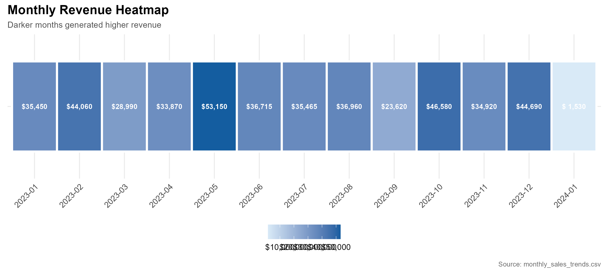
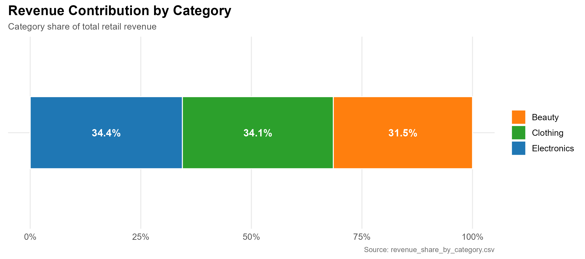
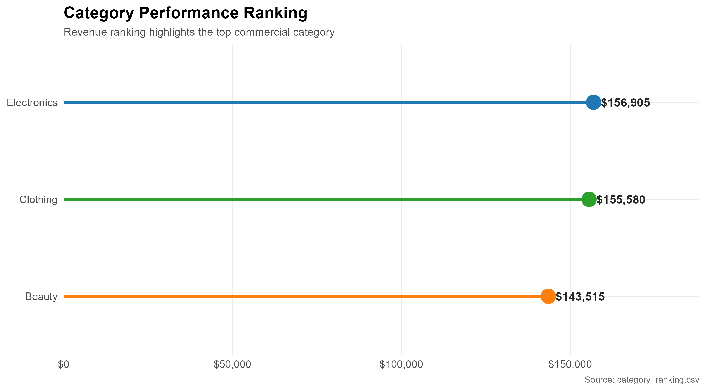
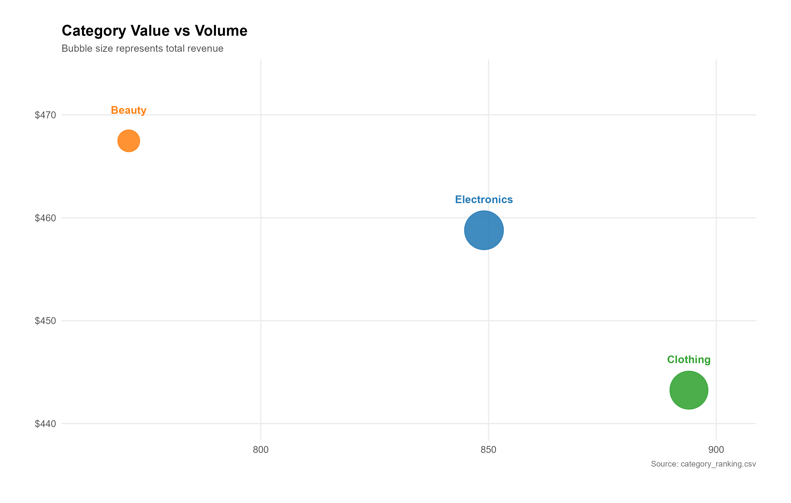
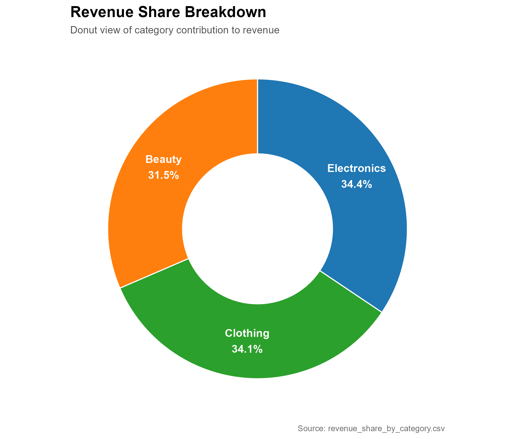
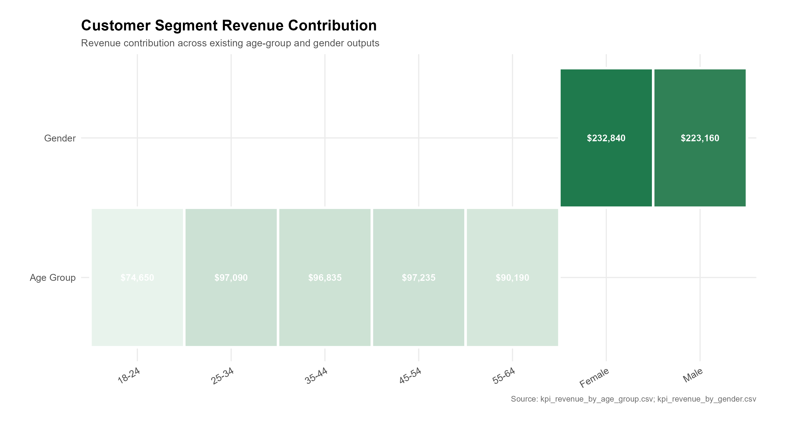
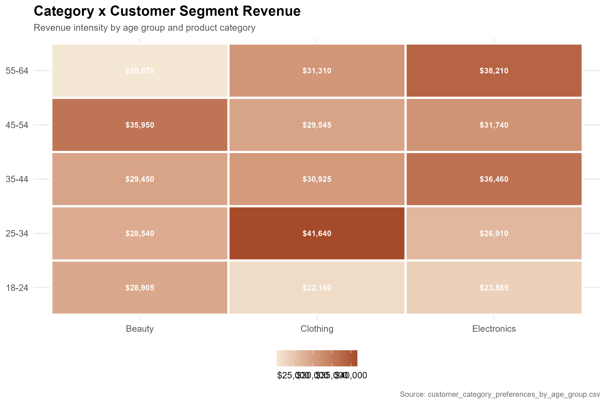

```{css}
.navbar .navbar-brand {
  font-size: 1rem;
}

.navbar .nav-link,
.nav-tabs .nav-link {
  font-size: 0.95rem;
}

.quarto-dashboard .card-header,
.quarto-dashboard .card-title {
  font-size: 1.05rem;
  font-weight: 600;
}

.table {
  font-size: 0.95rem;
  line-height: 1.35;
  width: 100%;
}

.table th {
  font-size: 0.95rem;
  white-space: nowrap;
}

.table td {
  vertical-align: middle;
}

.cell-output-display {
  overflow-x: auto;
}

.dashboard-plot img {
  width: 100%;
  height: auto;
}
```

```{r}
library(readr)
library(dplyr)
library(knitr)

format_currency <- function(x) {
  paste0("$", trimws(format(round(x, 0), big.mark = ",", scientific = FALSE)))
}

format_currency_table <- function(x) {
  paste0("\\$", trimws(format(round(x, 0), big.mark = ",", scientific = FALSE)))
}

format_number <- function(x) {
  trimws(format(round(x, 0), big.mark = ",", scientific = FALSE))
}

format_percent <- function(x) {
  paste0(round(x * 100, 1), "%")
}

dashboard_kpis <- read_csv("outputs/dashboard_kpis.csv", show_col_types = FALSE)
executive_summary <- read_csv("outputs/executive_summary.csv", show_col_types = FALSE)
business_insights <- read_csv("outputs/business_insights.csv", show_col_types = FALSE)

monthly_revenue <- read_csv("outputs/monthly_revenue.csv", show_col_types = FALSE)
monthly_transactions <- read_csv("outputs/monthly_transactions.csv", show_col_types = FALSE)
monthly_units_sold <- read_csv("outputs/monthly_units_sold.csv", show_col_types = FALSE)
monthly_average_order_value <- read_csv(
  "outputs/monthly_average_order_value.csv",
  show_col_types = FALSE
)

monthly_revenue_display <- monthly_revenue %>%
  filter(year_month != "2024-01")

monthly_transactions_display <- monthly_transactions %>%
  filter(year_month != "2024-01")

monthly_units_sold_display <- monthly_units_sold %>%
  filter(year_month != "2024-01")

monthly_average_order_value_display <- monthly_average_order_value %>%
  filter(year_month != "2024-01")

revenue_by_category <- read_csv("outputs/revenue_by_category.csv", show_col_types = FALSE)
category_ranking <- read_csv("outputs/category_ranking.csv", show_col_types = FALSE)
revenue_share_by_category <- read_csv(
  "outputs/revenue_share_by_category.csv",
  show_col_types = FALSE
)
average_order_value_by_category <- read_csv(
  "outputs/average_order_value_by_category.csv",
  show_col_types = FALSE
)

customer_revenue_by_gender <- read_csv(
  "outputs/customer_revenue_by_gender.csv",
  show_col_types = FALSE
)
customer_revenue_by_age_group <- read_csv(
  "outputs/customer_revenue_by_age_group.csv",
  show_col_types = FALSE
)
customer_category_preferences_by_age_group <- read_csv(
  "outputs/customer_category_preferences_by_age_group.csv",
  show_col_types = FALSE
)

business_insights_display <- business_insights %>%
  filter(!grepl("2024-01|January 2024", paste(insight, evidence, business_meaning)))
```

# Executive Overview

## KPI Snapshot

```{r}
#| content: valuebox
#| title: "Total Revenue"
#| icon: currency-dollar
list(value = format_currency(dashboard_kpis$total_revenue[1]))
```

```{r}
#| content: valuebox
#| title: "Transactions"
#| icon: receipt
list(value = format_number(dashboard_kpis$total_transactions[1]))
```

```{r}
#| content: valuebox
#| title: "Units Sold"
#| icon: boxes
list(value = format_number(dashboard_kpis$total_units_sold[1]))
```

```{r}
#| content: valuebox
#| title: "Average Order Value"
#| icon: cart
list(value = format_currency(dashboard_kpis$average_order_value[1]))
```

```{r}
#| content: valuebox
#| title: "Top Category"
#| icon: trophy
list(value = executive_summary$top_revenue_category[1])
```

## Performance View

```{r}
#| classes: dashboard-plot
#| out-width: "100%"

```

## Business Summary

```{r}
business_insights_display %>%
  select(rank, insight, business_meaning, recommended_action) %>%
  head(3) %>%
  kable(
    col.names = c("Rank", "Executive Insight", "Business Meaning", "Recommended Action"),
    escape = FALSE
  )
```

# Sales Trends

## Monthly Revenue

```{r}
monthly_revenue_display %>%
  mutate(total_revenue = format_currency_table(total_revenue)) %>%
  kable(col.names = c("Year-Month", "Revenue"), escape = FALSE)
```

## Monthly Transactions

```{r}
monthly_transactions_display %>%
  mutate(total_transactions = format_number(total_transactions)) %>%
  kable(col.names = c("Year-Month", "Transactions"))
```

## Monthly Units Sold

```{r}
monthly_units_sold_display %>%
  mutate(total_units_sold = format_number(total_units_sold)) %>%
  kable(col.names = c("Year-Month", "Units Sold"))
```

## Monthly AOV

```{r}
monthly_average_order_value_display %>%
  select(year_month, average_order_value) %>%
  mutate(average_order_value = format_currency_table(average_order_value)) %>%
  kable(col.names = c("Year-Month", "Average Order Value"), escape = FALSE)
```

# Category Performance

## Revenue Contribution

```{r}
#| classes: dashboard-plot
#| out-width: "100%"

```

## Category Ranking

```{r}
#| classes: dashboard-plot
#| out-width: "100%"

```

```{r}
category_ranking %>%
  mutate(
    total_revenue = format_currency_table(total_revenue),
    units_sold = format_number(units_sold),
    average_order_value = format_currency_table(average_order_value),
    revenue_share = format_percent(revenue_share)
  ) %>%
  select(
    product_category,
    total_revenue,
    total_transactions,
    units_sold,
    average_order_value,
    revenue_share,
    revenue_rank,
    transaction_rank,
    units_rank,
    aov_rank
  ) %>%
  kable(
    col.names = c(
      "Category",
      "Revenue",
      "Transactions",
      "Units Sold",
      "AOV",
      "Revenue Share",
      "Revenue Rank",
      "Transaction Rank",
      "Units Rank",
      "AOV Rank"
    ),
    escape = FALSE
  )
```

## Value vs Volume

```{r}
#| classes: dashboard-plot
#| out-width: "100%"

```

## Revenue Share and AOV

```{r}
#| classes: dashboard-plot
#| out-width: "100%"

```

```{r}
average_order_value_by_category %>%
  mutate(
    total_revenue = format_currency_table(total_revenue),
    average_order_value = format_currency_table(average_order_value)
  ) %>%
  kable(
    col.names = c("Category", "Revenue", "Transactions", "Average Order Value"),
    escape = FALSE
  )
```

# Customer Segments

## Segment Contribution

```{r}
#| classes: dashboard-plot
#| out-width: "100%"

```

## Revenue by Gender

```{r}
customer_revenue_by_gender %>%
  mutate(
    total_revenue = format_currency_table(total_revenue),
    total_units_sold = format_number(total_units_sold)
  ) %>%
  kable(col.names = c("Gender", "Revenue", "Transactions", "Units Sold"), escape = FALSE)
```

## Revenue by Age Group

```{r}
customer_revenue_by_age_group %>%
  mutate(
    total_revenue = format_currency_table(total_revenue),
    total_units_sold = format_number(total_units_sold)
  ) %>%
  kable(col.names = c("Age Group", "Revenue", "Transactions", "Units Sold"), escape = FALSE)
```

## Category Preference

```{r}
#| classes: dashboard-plot
#| out-width: "100%"

```

```{r}
customer_category_preferences_by_age_group %>%
  mutate(
    total_revenue = format_currency_table(total_revenue),
    total_units_sold = format_number(total_units_sold),
    average_order_value = format_currency_table(average_order_value),
    revenue_share_within_age_group = format_percent(revenue_share_within_age_group)
  ) %>%
  kable(
    col.names = c(
      "Age Group",
      "Category",
      "Revenue",
      "Transactions",
      "Units Sold",
      "AOV",
      "Revenue Share Within Age Group",
      "Preference Rank"
    ),
    escape = FALSE
  )
```

# Insights & Recommendations

## Executive Insights

```{r}
business_insights_display %>%
  select(rank, insight, evidence, business_meaning, recommended_action) %>%
  kable(
    col.names = c(
      "Rank",
      "Insight",
      "Evidence",
      "Business Meaning",
      "Recommended Action"
    ),
    escape = FALSE
  )
```

